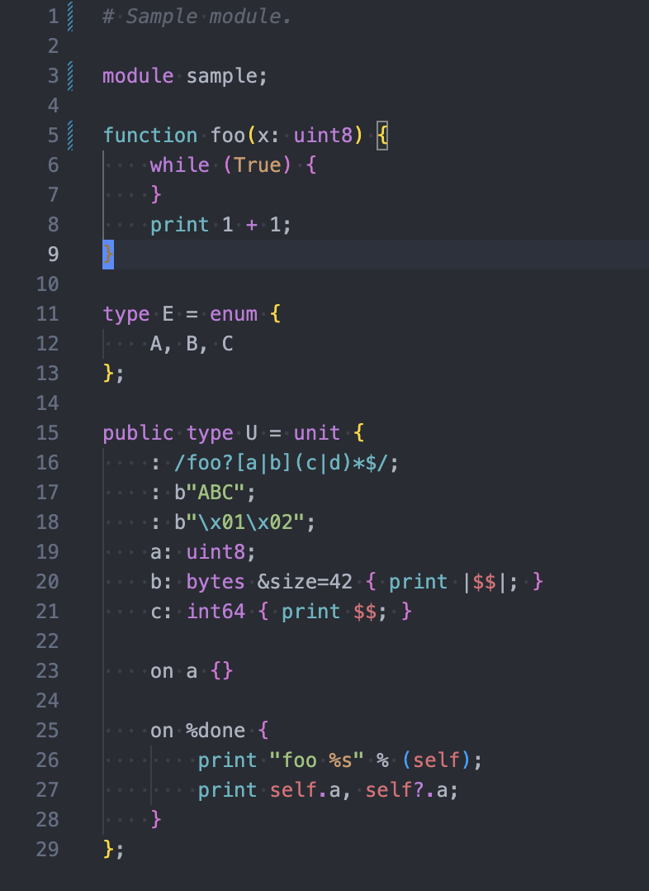

# Spicy support for Visual Studio Code

This extension provides syntax highlighting for the [Spicy language](https://docs.zeek.org/projects/spicy).

## Known Issues

- We likely only provide incomplete coverage of language constructs.
- Syntax highlighting is only minimally aware of the structure of the code and
  where certain tokens appear. This likely leads to cases of incorrect
  highlighting.

Patches to improve language support are welcome.
